Statistics and charts for Trello boards, now in a Django app.

# What's this?

Django Trello Stats is a web site that allows you to connect to your Trello user and fetch data from your boards.

The fetched data is processed and you are presented with several stats for each project that help you take
strategic decisions like:

- Is the maximum *work in progress* for each state/list being followed?
- Is there some tasks that are going back to earlier states too much?
- How many hours are your team working and in what projects?
- What's the lead and cycle time of each project tasks?
- Is the project on time according to its percentage of completion?

## Demo site

[Python Anywhere Demo](https://djangotrellostats.pythonanywhere.com/)

Sign up in this site or use user test@mailinator.com and password **test**.

Note: don't store any sensible information or file you would like to keep
because database is recreated each few hours.


## Want to see it running in your computer? It's easy:

Run this commands in your terminal:

```sh
sudo apt-get update
sudo apt-get -y install git python python-dev virtualenv build-essential\ 
    libssl-dev libffi-dev libmysqlclient-dev libxml2-dev libxslt1-dev
git clone https://github.com/diegojromerolopez/django-trello-stats
cd django-trello-stats
./start_local_server.sh
```

And open your web browser in the address http://localhost:8000

# How does it work?

First you have to sign up with your Trello API credentials. Initialize your boards and customize the type of each board list.

Once you have your boards ready, fetch the data.

You can also give other board members access to the dashboard. Each member will be able to access to his/her own boards, so it is perfect for a multi-project team.


# Requirements

## Plus for Trello

Use [Plus for Trello](https://chrome.google.com/webstore/detail/plus-for-trello-time-trac/gjjpophepkbhejnglcmkdnncmaanojkf?hl=en)
in your boards to allow this application to get card spent and estimated times.

Configure Plus for Trello to use **time storage in comments**. Otherwise, Django Trello Stats will be unable to track spend and estimated time.

Don't use the feature of assigning times to other members of the team because it is not implemented yet.

## Py-Trello

[This library](https://github.com/sarumont/py-trello) is free software and I've collaborated with Py-Trello team to include all features required for Django-Trello-Stats.

## System packages

Run this command to install all the needed packages for this project in Ubuntu/Debian.

```sh
sudo apt-get -y install git python python-dev virtualenv build-essential libssl-dev libffi-dev\
   libmysqlclient-dev libxml2-dev libxslt1-dev
```

## Other packages

Django, python-mysql and more packages specified in **requirements.txt**.

## External requirements (optional)

### cloc

[cloc](https://github.com/AlDanial/cloc) is a tool to count lines of code.

It is used to compute the errors per LOC when assessing code quality.

### PHPMD

[PHP Mess Detector](https://phpmd.org/) is needed in you want to assess PHP code.

Install it by typing in Linux:

```sh
sudo apt-get install phpmd
```

Or in MacOS (using brew):

```sh
brew install homebrew/php/phpmd
```

# Configuration

## Local settings

Copy this code and create a settings_local.py file in your server in **src**.

Write your database credentials and your domain. Switch off debug messages.

I've used MySQL as the DBMS but you can use whatever you want.

```python
# -*- coding: utf-8 -*-

# SECURITY WARNING: keep the secret key used in production secret!
SECRET_KEY = '<whatever string you want>'

# SECURITY WARNING: don't run with debug turned on in production!
DEBUG = True

# Set your email to be notified when a 500 error happens
ADMINS = (
    ("Your name", "youremail@example.com"),
)

DOMAIN = "<your domain>"
ALLOWED_HOSTS = [DOMAIN]

DATABASES = {
    'default': {
        'ENGINE': 'django.db.backends.<dbms>',
        'NAME': '<database name>',
        'USER': '<user>',
        'PASSWORD': '<password>',
        'HOST': '',
        'PORT': ''
    }
}

LANGUAGE_CODE = '<language code>'
TIME_ZONE = "<TIME ZONE>"

EMAIL_USE_TLS = <USE TLS?>
EMAIL_HOST = '<email host>'
EMAIL_PORT = <email host portr>
EMAIL_HOST_USER = '<email host user>'
EMAIL_HOST_PASSWORD = '<email host user password>'
DEFAULT_FROM_EMAIL = '<email host user from email>'
SERVER_EMAIL = '<email host user from email>'

# Date format that will be used in templates, by default is Y-m-d. Optional.
DATE_FORMAT = "<LOCAL DATE FORMAT IN TEMPLATES>"

# Datetime format that will be used in templates, by default is Y-m-d H:i. Optional.
DATETIME_FORMAT = "<LOCAL DATETIME FORMAT IN TEMPLATES>"

```

## Sign up

First you need to sign up with the api key, token and token secret.

This action will create a new user in the system.

User your email to log in the application.

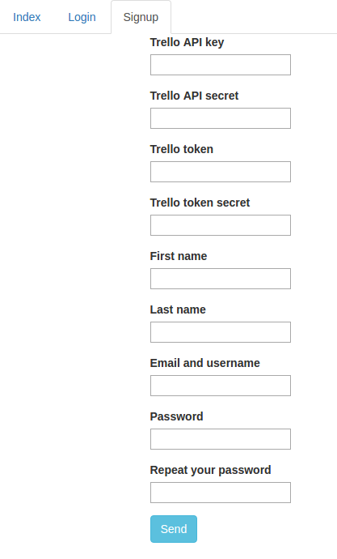

## Initialize boards and lists

Later, you need to initialize the boards.

Use this command:

```python
python src/manage.py init <trello_username>
```

This initialization is only done for boards that are not initialized.

So, if you create a new board, execute the command again without fear of losing data.

## Set up boards

Setting up which lists of the board are the "development" and "done" lists.

Thus, the rest of the lists must be positioned before or after the development lists.

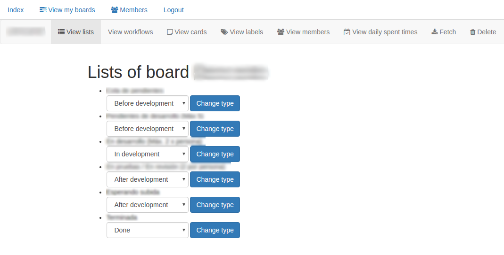

## Fetch cards

And of course, you have to fetch the cards.

```python
python src/manage.py fetch <trello_username>
```

You'll need to set this action in a cron action and call it each hour or half-hour.

This process takes several seconds for each board (only three requests are needed per board).
In my tests, for 4 boards, the process takes 1 minute.

If you want to call this action, there is a button that allows you to fetch all the board data:

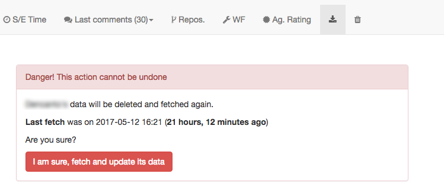

And that's all, then you have several interfaces with data about members, labels, cards and daily spent times

# Assess repository code (optional)

Run this command once a day to assess the code quality of your GitLab repositories.

```python
python src/manage.py assess_code_quality
```

# Test 

Want to test this web application?

Run this commands in your terminal:

```sh
sudo apt-get -y install git python python-dev virtualenv build-essential\ 
    libssl-dev libffi-dev libmysqlclient-dev libxml2-dev libxslt1-dev
git clone https://github.com/diegojromerolopez/django-trello-stats
cd django-trello-stats
./start_local_server.sh
```

And open your favorite web browser in the address https://localhost:8000

# Board interfaces

## Board header

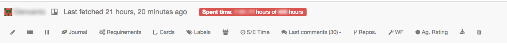

## Board view


## Board public view

A subset of board view, this view allows sharing stats with stakeholders that are not members of each Trello board.

## Board cards

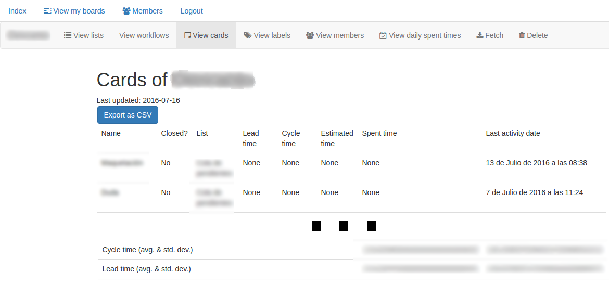

## Card reviews

To mark a card as reviewed, write **Reviewed by ** followed by the prefixed-by-@-usernames of the board members that reviewed this card.

For example: **Reviewed by @anastasious45 @petra99** means that both members (anastasious45 and petra99 have contributed to this card review.)


## Board blocked cards

To block a card, make a comment in the blocked card with the following text:
**Blocked by CARD_URL** where CARD_URL is the URL of the blocking card in this board.

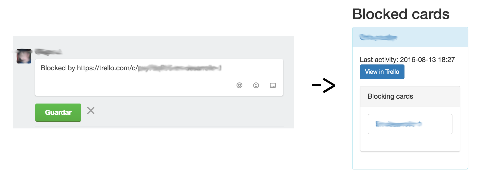

## Board requirements

To associate a card to a requirement make a comment in that card with the following text:
**Task of requirement REQUIREMENT_CODE** where REQUIREMENT_CODE is the unique requirement code
of this requirement.

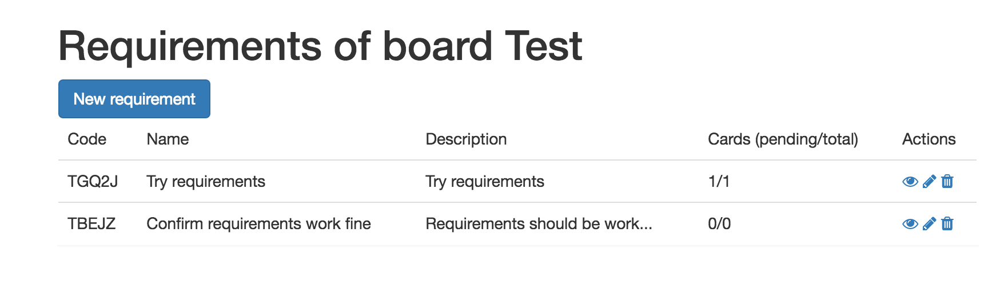

## Board labels

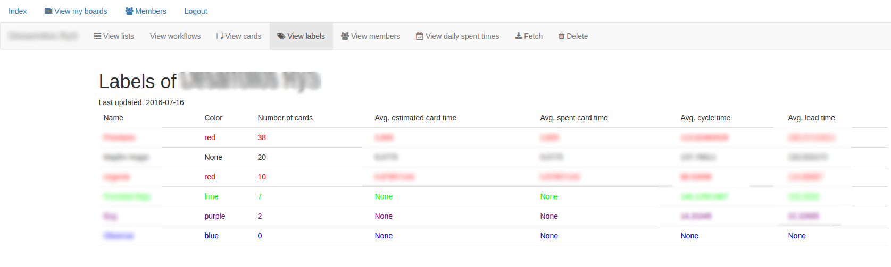

## Board members

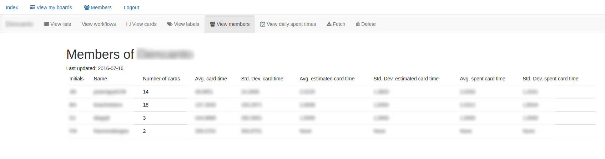

## Board spent times


# Member interfaces

## What members have access to at least one board

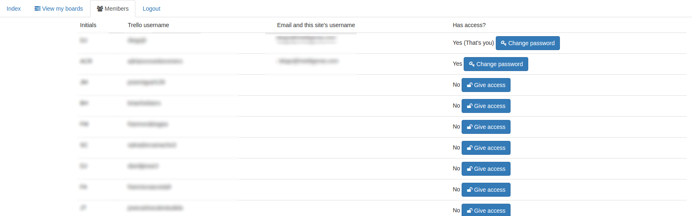

## Giving access to his/her boards in this platform

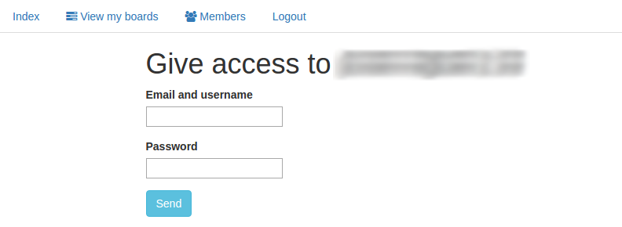

# Permissions

There is no use of django permissions yet.

Only board creators have especial permissions with the board they created.  

# Reports

## Daily report

Send a daily report with the spent times to each administrator user:

```python
python src/manage.py reporter daily_report [date of the report, by default today]
```

## Daily development report

Send a daily report with the spent times of each developer.

```python
python src/manage.py reporter daily_development_report [date of the report, by default today]
```

## Weekly report

Send a weekly report with the spent times to each administrator user:

```python
python src/manage.py reporter weekly_report [date whose week we want to get the report, by default current week]
```

## Monthly report

Send a monthly report with the spent times to each administrator user:

```python
python src/manage.py reporter monthly_report [date whose month we want to get the report, by default current month]
```


## Workflows

Workflows are a feature that will allow you to define what lists have to be
considered to measure spent, estimated and card living times.

Workflow stats are partially completed. Only the average time in each list and the standard deviation time on each list is shown for each workflow.


# Contributing

I would gladly accept feature requests, pull requests and suggestions.

All contributors must sign an intellectual property cession to the
creator of this project (Diego J. Romero-López). 


# Legal notice

This project is not affiliated, endorsed or supported in any way by [Trello Inc.](http://trello.com)

Trello is a registered trademark in USA and other countries.

This project uses [Trello API](https://developers.trello.com/) to help users of Trello to get some useful charts, lists and stats.

The IP (intellectual property) of this project belongs to Diego J. Romero-López. The license of this project is [MIT](LICENSE) and the logos have been created with [Mark Maker](http://emblemmatic.org/markmaker).

# Questions? Suggestions? Need some help?

Don't hesitate to contact me, write me to diegojREMOVETHISromeroREMOVETHISlopez@REMOVETHISgmail.REMOVETHIScom.

(remove REMOVETHIS to see the real email address)